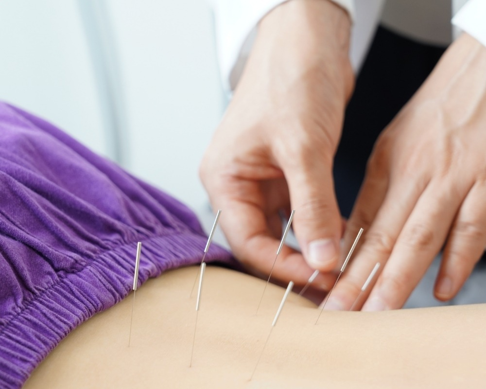

Você sabia que a dor crônica e a ansiedade costumam caminhar juntas? Esse ciclo vicioso afeta o sono, a produtividade e, principalmente, a sua alegria de viver. No **Instituto do Bem-Estar**, entendemos que o corpo não deve ser tratado em partes isoladas. É aqui que a **acupuntura**, um dos pilares da Medicina Tradicional Chinesa (MTC), revela-se uma ferramenta poderosa para devolver a qualidade de vida.

**Leia também:** [O que é Acupuntura](/blog/o-que-e-acupuntura)

### **O que é a Acupuntura e como ela atua no corpo?**

A acupuntura é uma técnica milenar que utiliza o agulhamento em pontos específicos do corpo para estimular o sistema nervoso. Diferente do que muitos pensam, o processo é praticamente indolor e extremamente relaxante.

Quando as agulhas atingem esses pontos estratégicos, o cérebro recebe sinais para liberar substâncias químicas naturais, como:

-   **Endorfinas e Encefalinas:** Analgésicos naturais que combatem a dor.
-   **Serotonina:** O hormônio do bem-estar, essencial para o controle do humor e da ansiedade.

### **O Poder da Acupuntura no Controle da Ansiedade**

Em um mundo cada vez mais acelerado, a ansiedade se tornou um desafio comum. A acupuntura atua diretamente no sistema nervoso autônomo, ajudando a “desligar” o estado de alerta constante (luta ou fuga) e ativando o estado de relaxamento.

Os pacientes que buscam o Instituto para tratar quadros ansiosos frequentemente relatam:

1.  Melhora imediata na qualidade do sono.
2.  Redução da irritabilidade e palpitações.
3.  Maior clareza mental para lidar com os desafios diários.

### **Alívio da Dor: Do Físico ao Emocional**

Seja uma dor lombar, cervicalgia ou dores reumáticas, a acupuntura foca na causa raiz e não apenas no sintoma. Ao melhorar a circulação sanguínea local e reduzir inflamações, ela é uma aliada essencial em **projetos de reabilitação física**.

**Dica do Especialista:** No Instituto do Bem-Estar, muitas vezes combinamos a acupuntura com a **Fisioterapia** ou **Ozonioterapia** para acelerar a recuperação de lesões complexas, garantindo resultados mais rápidos e sustentáveis.

### **Por que escolher o Instituto do Bem-Estar?**

Com 18 anos de atuação e mais de **10.000 pacientes atendidos**, nossa clínica não oferece apenas uma sessão de agulhas. Oferecemos um **projeto de cuidado integral**.

-   **Experiência:** Especialistas que dominam a MTC e outras técnicas como [Moxabustão](https://www.tuasaude.com/moxabustao/) e Ventosaterapia. 
-   Que além da formação técnica possuem a vivência prática em hospitais e clínicas Chinesas, esta constante troca cultural permite uma melhor preparação para obtenção de resultados efetivos e duradouros
-   **Infraestrutura:** Atendimento individualizado em um ambiente planejado para o seu relaxamento.
-   **Visão Holística:** Restabelecemos sua saúde física, mental e espiritual.

### **Conclusão**

A dor e a ansiedade não precisam ser parte da sua rotina. A acupuntura é um caminho seguro, comprovado cientificamente e livre de efeitos colaterais químicos para você reencontrar seu equilíbrio.

**Gostou de entender como a acupuntura pode transformar sua saúde?** [Clique aqui para falar com nossos especialistas pelo WhatsApp](/contato) e agende sua avaliação personalizada no Instituto do Bem-Estar. Deixe-nos cuidar de você!
