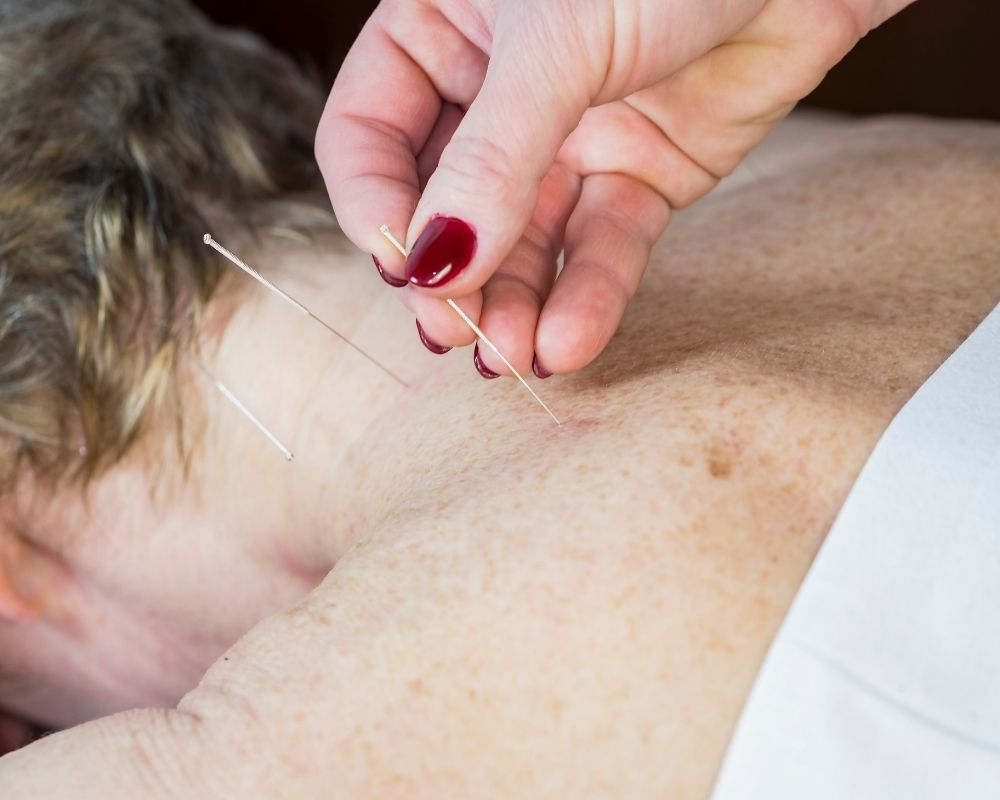

Viver com dor nas costas não precisa ser o seu “novo normal”. Seja por conta de longas horas de trabalho, má postura ou lesões acumuladas, a dor lombar e cervical afeta diretamente sua produtividade e felicidade. Se você está em **São Caetano do Sul** e busca uma solução eficaz e sem o uso excessivo de medicamentos, a **acupuntura** é o caminho para recuperar seu bem-estar.

No **Instituto do Bem-Estar**, unimos a sabedoria milenar da Medicina Tradicional Chinesa (MTC) com uma visão moderna de reabilitação para tratar a causa da sua dor, não apenas o sintoma.

## Como a Acupuntura age contra a dor nas costas?

A acupuntura vai muito além da aplicação de agulhas. Em 2026, a ciência já consolidou o que os antigos mestres sabiam: o agulhamento em pontos específicos estimula o sistema nervoso a liberar **[endorfinas e serotonina](https://essentia.com.br/conteudos/hormonios-da-felicidade/)**, nossos analgésicos naturais.

Ao buscar tratamento conosco, você garante:

- **Redução da Inflamação:** Melhora a circulação sanguínea no local da dor.

- **Relaxamento Muscular Profundo:** Ideal para quem sofre de contraturas por estresse.

- **Equilíbrio Energético:** Harmoniza o fluxo de energia (Qi), promovendo uma sensação de leveza imediata.

## O Diferencial do Instituto do Bem-Estar em São Caetano do Sul

Com sede própria e tradição desde 2007, o **Instituto do Bem-Estar** já cuidou de mais de 10.000 pacientes. Por que somos a escolha certa para você?

### Atendimento Personalizado e Especializado

Diferente de clínicas de massa, aqui cada paciente passa por uma avaliação criteriosa. Nossos especialistas em acupuntura entendem que uma dor na lombar pode ter origens emocionais ou posturais distintas.

### Técnicas Integrativas e Complementares

Para potencializar os resultados, utilizamos recursos avançados da MTC:

- **Moxabustão:** O uso do calor para remover o “frio” e a rigidez das articulações.

- **Ventosaterapia:** Excelente para desintoxicação muscular e alívio de tensões crônicas nas costas.

- **Fisioterapia e Pilates Clínico:** Caso sua dor exija reabilitação física, nossa estrutura completa oferece suporte integral em um só lugar.

> “Nossa missão é construir projetos integrativos de reabilitação que entreguem resultados sustentáveis e duradouros.”

## O que esperar da sua primeira sessão?

Muitas pessoas hesitam por medo das agulhas. No entanto, o processo é praticamente indolor e extremamente relaxante. No nosso ambiente em São Caetano, você encontrará uma infraestrutura moderna e acolhedora, projetada para que seu tratamento seja um momento de paz no seu dia.

## Perguntas Frequentes (FAQ)

**1. Quantas sessões de acupuntura são necessárias para dor nas costas?** Geralmente, nota-se alívio nas primeiras 3 sessões, mas um protocolo completo de 10 sessões é recomendado para resultados duradouros e tratamento da causa raiz.

**2. O Instituto do Bem-Estar atende convênios em São Caetano?** Somos uma clínica particular focada em excelência e atendimento individualizado. Entre em contato para conhecer nossas condições e facilidades para o seu tratamento.

**3. A acupuntura serve para qualquer tipo de dor na coluna?** Sim, é eficaz para hérnia de disco, ciatalgia (dor no nervo ciático), cervicalgia e dores musculares comuns.

### Agende sua avaliação hoje mesmo

Não permita que a dor nas costas limite seus movimentos em 2026. Venha para o **Instituto do Bem-Estar** em São Caetano do Sul e descubra como a combinação de ética, compaixão e técnica pode transformar sua saúde.

[Quero Agendar Minha Sessão de Acupuntura](/contato/)
