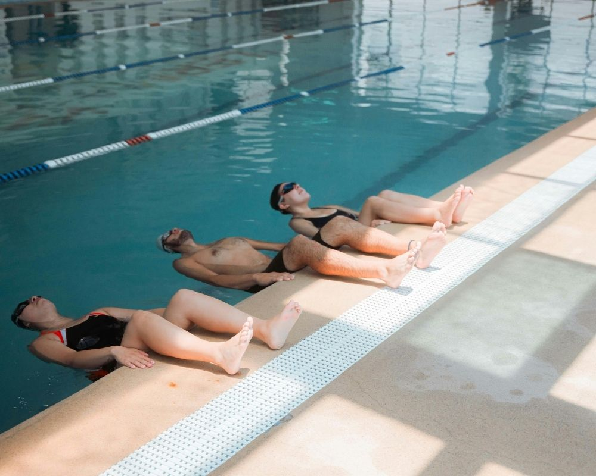

Viver sem dor e recuperar a mobilidade é o desejo de quem busca uma **clínica de bem-estar com hidroterapia em São Caetano do Sul**. Em 2026, a busca por terapias que unem a ciência da fisioterapia ao conforto da água aquecida cresceu exponencialmente. Mas você sabe como escolher o lugar certo para o seu projeto de reabilitação?

No **Instituto do Bem-Estar**, entendemos que cada corpo é único. Com quase duas décadas de história e mais de **10.000 vidas transformadas**, sabemos que a hidroterapia vai muito além de uma simples piscina: é uma ferramenta de cura profunda.

## **O que é a Hidroterapia (Fisioterapia Aquática) e por que ela é tão eficaz?**

A hidroterapia utiliza as propriedades físicas da água — como o empuxo, a pressão hidrostática e a temperatura (mantida entre **32°C e 34°C**) — para facilitar movimentos que seriam dolorosos ou impossíveis em solo.

### **Os principais benefícios comprovados:**

-   **Redução de Impacto:** O empuxo reduz em até **90% o peso corporal** sobre as articulações, ideal para quem sofre com hérnia de disco ou artrose.
-   **Alívio Imediato da Dor:** A água quente promove a vasodilatação, relaxando a musculatura e liberando endorfinas.
-   **Fortalecimento Global:** A resistência natural da água trabalha todos os grupos musculares sem o risco de lesões por sobrecarga.
-   **Melhora Cardiorrespiratória:** A pressão da água auxilia no retorno venoso e na capacidade pulmonar.

## **Diferenciais do Instituto do Bem-Estar em São Caetano do Sul**

Escolher uma clínica em São Caetano exige atenção à infraestrutura e ao corpo técnico. No Instituto do Bem-Estar, nosso compromisso com a **excelência no atendimento** é o que nos mantém como referência desde 2007.

### **1\. Projetos de Reabilitação Personalizados**

Diferente de academias comuns, aqui a hidroterapia é desenvolvida por **fisioterapeutas especialistas**. Criamos um ciclo terapêutico baseado no diagnóstico funcional de cada paciente, garantindo resultados sustentáveis e duradouros.

### **2\. Visão Holística e Terapias Integrativas**

Acreditamos no cuidado integral. Por isso, seu plano de hidroterapia pode ser potencializado com outras especialidades da nossa clínica, como:

-   **Ozonioterapia:** Para acelerar processos anti-inflamatórios.
-   **Acupuntura:** Equilibrando a energia e aliviando dores crônicas.
-   **Terapias Manuais:** Como a Microfisioterapia para tratar traumas emocionais e físicos.

### **3\. Ambiente Seguro e Acolhedor**

Nossa infraestrutura é planejada para oferecer acessibilidade, higiene rigorosa e um atendimento humanizado que respeita o tempo de cada paciente.

## **Para quem a Hidroterapia é indicada?**

Nossa clínica em São Caetano atende diversos perfis que buscam qualidade de vida em 2026:

-   **Idosos:** Para prevenção de quedas, ganho de equilíbrio e socialização.
-   **Pós-operatórios:** Especialmente cirurgias de joelho, quadril e coluna.
-   **Atletas:** Para recuperação muscular rápida (recovery) e tratamento de lesões.
-   **Gestantes:** Alívio de inchaços e dores lombares com total segurança.

## **Perguntas Frequentes (FAQ)**

**A hidroterapia substitui a fisioterapia convencional?** Não necessariamente. Elas são complementares. Em muitos casos, iniciamos na água para reduzir a dor e, conforme o paciente evolui, integramos exercícios em solo.

**Preciso saber nadar para fazer hidroterapia?** De forma alguma! As sessões são acompanhadas por um fisioterapeuta dentro ou fora da piscina, em profundidades seguras onde você mantém o pé no chão.

**O Instituto do Bem-Estar atende convênios?** Somos uma clínica particular focada em atendimento personalizado e individualizado. Entre em contato para conhecer nossas facilidades e pacotes de ciclos terapêuticos.

## **Comece sua jornada de bem-estar hoje mesmo**

Se você procura uma **clínica de bem-estar com hidroterapia em São Caetano do Sul** que combine ética, compaixão e tecnologia de ponta, o Instituto do Bem-Estar é o seu lugar.**Não deixe sua saúde para depois.** Recupere sua autonomia e volte a fazer o que você ama com quem entende de reabilitação.

[**Clique aqui e fale com nossa equipe pelo WhatsApp**](https://api.whatsapp.com/send/?phone=5511934491001&text=Ol%C3%A1%2C+td+bem%3F+Gostaria+de+saber+mais+sobre+Instituto+do+Bem+Estar+na+https%3A%2F%2Fibemestarscs.com.br%2F&type=phone_number&app_absent=0)
