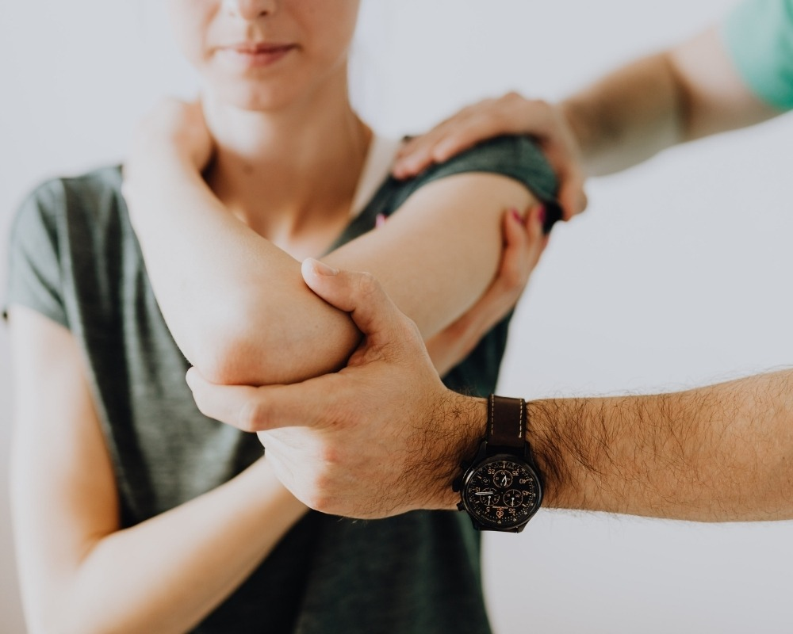

Sentir dor ou ter movimentos limitados não deve ser parte da sua rotina. Se você busca por **fisioterapia em São Caetano do Sul**, sabe que encontrar uma clínica que una tecnologia, profissionais experientes e um atendimento humanizado é o primeiro passo para uma recuperação de sucesso.

No **Instituto do Bem Estar**, acreditamos que a reabilitação vai além de tratar um sintoma; trata-se de devolver a você a liberdade de se movimentar sem dor e a alegria de viver plenamente.

**Leia também: **[Hidroterapia ou Fisioterapia: Qual a Melhor Opção para Tratar Dores Crônicas?](/blog/hidroterapia-ou-fisioterapia-qual-a-melhor-opcao/)

## Por que escolher o Instituto do Bem Estar em São Caetano do Sul?

Desde 2007, nossa clínica se destaca no ABC Paulista por oferecer um padrão de excelência em reabilitação. Com mais de **10.000 pacientes atendidos**, consolidamos nossa autoridade através de resultados sustentáveis.

Diferente de modelos de atendimento genéricos, aqui cada paciente é único. Nossa infraestrutura é planejada para oferecer conforto e tratamentos individualizados, utilizando o que há de mais moderno na ciência do movimento.

## Nossas Especialidades: Cuidado Completo para Você

Para garantir uma recuperação eficaz, oferecemos diversas frentes de atuação dentro da fisioterapia:

- **Fisioterapia Ortopédica e Reumatológica:** Focada em lesões musculares, dores na coluna, articulações e pós-operatórios.

- **Pilates Clínico:** Diferente do Pilates convencional, aqui ele é conduzido por fisioterapeutas para garantir que cada exercício respeite suas limitações e fortaleça seu corpo de forma segura.

- **Hidroterapia:** Nossa piscina terapêutica permite uma reabilitação com impacto reduzido, ideal para casos de dor aguda, idosos ou recuperação acelerada.

- **Fisioterapia Pediátrica e Esportiva:** Atendimento especializado para todas as fases da vida e níveis de atividade física.

## O Diferencial: Método ADERCO e Terapias Integrativas

O grande segredo dos nossos resultados rápidos e eficazes é o **Método ADERCO**. Trata-se de uma metodologia exclusiva que sistematiza o processo de:

- **A**valiação profunda;

- **D**iagnóstico preciso;

- **E**xecução técnica;

- **R**eavaliação constante;

- **CO**nsultoria e orientação ao paciente.

Além disso, somos pioneiros na integração da fisioterapia com técnicas avançadas como a **Ozonioterapia** (que acelera a regeneração tecidual e combate inflamações) e a **Microfisioterapia** (que identifica e trata as causas emocionais e traumáticas gravadas no corpo).

**Dica de Especialista:** “A fisioterapia moderna não olha apenas para o músculo, mas para o ser humano como um todo — físico, mental e espiritual.”

## Como funciona o atendimento no Instituto do Bem Estar?

Ao agendar sua consulta, você passará por uma triagem detalhada. Nosso compromisso é com a **ética e a transparência**: só propomos o que realmente trará resultado para o seu caso.

**O que você encontrará aqui:**

- Equipamentos modernos de eletroterapia e cinesioterapia.

- Profissionais em constante atualização (especialistas, mestres e doutores).

- Ambiente acolhedor e focado no seu bem-estar integral.

### Pronto para voltar a se movimentar sem dor?

Não deixe sua saúde para depois. Se você mora em [São Caetano do Sul](https://www.saocaetanodosul.sp.gov.br/home) ou região e precisa de um projeto de reabilitação sério e focado em resultados duradouros, o Instituto do Bem Estar está de portas abertas para você.
