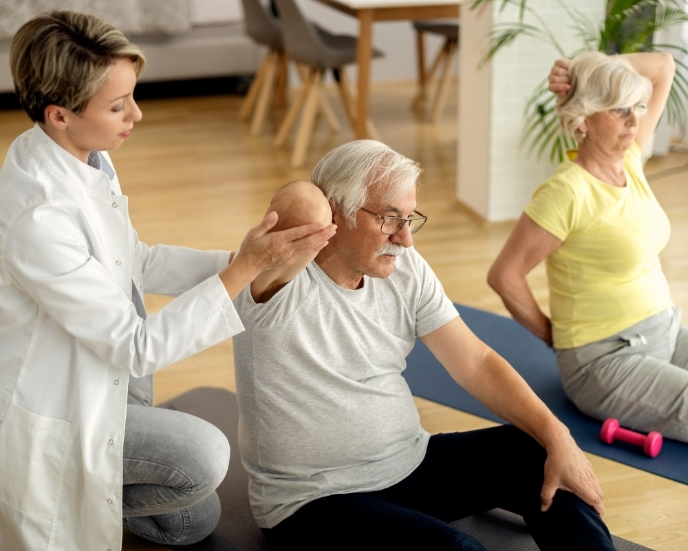

Envelhecer com saúde é o desejo de todos, mas manter a autonomia para realizar atividades simples do dia a dia — como caminhar até a padaria ou brincar com os netos — exige cuidado especializado. Na região do ABC, onde a população idosa cresce de forma ativa, a **fisioterapia para idosos** surge como o pilar principal para garantir que a maturidade seja sinônimo de liberdade, e não de limitações.

No **Instituto do Bem-Estar**, compreendemos que cada movimento conta. Com quase duas décadas de experiência em reabilitação, sabemos que o segredo não está apenas em tratar uma dor, mas em fortalecer a confiança do idoso em seu próprio corpo.

**Leia também: **[Hidroterapia ou Fisioterapia: Qual a Melhor Opção para Tratar Dores Crônicas?](/blog/hidroterapia-ou-fisioterapia-qual-a-melhor-opcao/)

## Por que a Fisioterapia é Vital para a Independência?

Com o passar dos anos, é natural que ocorra uma perda gradativa de massa muscular (sarcopenia) e uma diminuição do equilíbrio. A fisioterapia geriátrica atua diretamente nesses pontos, oferecendo:

- **Fortalecimento Muscular:** Protege as articulações e facilita a locomoção.

- **Treino de Equilíbrio:** Essencial para a **prevenção de quedas**, que são a maior causa de hospitalização em idosos.

- **Melhora da Flexibilidade:** Reduz a rigidez matinal e dores crônicas de artrite e artrose.

## Tratamentos que Potencializam os Resultados

Para oferecer uma recuperação sustentável e prazerosa, o Instituto do Bem-Estar integra diferentes técnicas que vão além da fisioterapia convencional:

### Hidroterapia: O Poder da Água

A nossa **piscina terapêutica** é um dos recursos mais procurados no ABC. A água morna reduz o peso corporal, permitindo que o idoso realize movimentos que seriam difíceis ou dolorosos no solo, promovendo relaxamento e ganho de força sem impacto nas articulações.

### Pilates Clínico para Idosos

Diferente do pilates fitness, o **Pilates Clínico** é ministrado por fisioterapeutas. Ele foca na correção postural e no fortalecimento do “core”, melhorando a sustentação do corpo e a coordenação motora.

Durante seu atendimento você contará com um profissional exclusivo, que além de melhorar os resultados do Pilates também aumentará a segurança na realização dos exercícios.

### Terapias Manuais e Microfisioterapia

Muitas vezes, a falta de mobilidade tem raízes emocionais ou traumas físicos antigos. Técnicas como a **Microfisioterapia** ajudam a identificar esses bloqueios, enquanto as terapias manuais aliviam tensões musculares imediatas.

**Nota de Especialista:** “O foco não é apenas viver mais, mas viver melhor. A reabilitação no idoso deve ser humanizada, respeitando o ritmo de cada paciente.” — Equipe Técnica, Instituto do Bem-Estar.

## Prevenção de Quedas: Um Compromisso com a Vida

No ABC, muitas residências possuem escadas ou calçadas irregulares. Nosso programa de fisioterapia inclui o treino de marcha e a simulação de atividades de vida diária ([AVDs](https://neuronup.com/br/atividades-de-neurorreabilitacao/atividades-da-vida-diaria-avds/atividades-da-vida-diaria-avds-definicao-classificacao-e-exercicios/)). Ensinamos o idoso a se levantar corretamente, a desviar de obstáculos e a fortalecer os reflexos, devolvendo a segurança para que ele circule por Santo André, São Bernardo ou São Caetano com tranquilidade.

## Por que escolher o Instituto do Bem-Estar no ABC?

Desde 2007, já cuidamos de mais de **10.000 vidas**. Localizado estrategicamente para atender a região do ABC, o Instituto oferece:

- **Avaliação Individualizada:** Não existem protocolos prontos; cada projeto de reabilitação é único.

- **Infraestrutura Moderna:** Equipamentos de ponta e ambientes acessíveis.

- **Abordagem Holística:** Unimos a Medicina Tradicional Chinesa (Acupuntura) à Fisioterapia moderna para um cuidado integral (físico, mental e espiritual).

## Conclusão

Manter a mobilidade é o caminho mais curto para a felicidade na terceira idade. Se você ou um familiar busca por **fisioterapia para idosos no ABC**, o Instituto do Bem-Estar está pronto para construir esse projeto de saúde com você.
