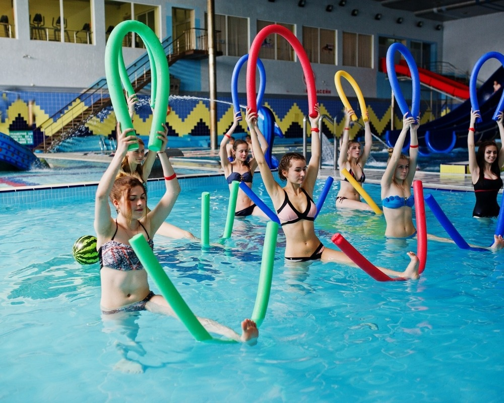

Viver com dor crônica é um desafio que afeta não apenas o corpo, mas também a saúde mental e a qualidade de vida. Se você sofre com dores persistentes na coluna, articulações ou condições como a fibromialgia, provavelmente já se deparou com a dúvida: **devo fazer fisioterapia convencional ou hidroterapia?**

No **Instituto Bem Estar**, com nossa experiência de quase duas décadas e mais de 10.000 pacientes atendidos, sabemos que não existe uma resposta única, mas sim a técnica ideal para o seu momento atual. Neste artigo, vamos detalhar as diferenças e ajudar você a entender qual o melhor caminho para sua recuperação.

**Leia também:** [O que é Acupuntura](/blog/o-que-e-acupuntura/)

## Fisioterapia Convencional: A Base da Reabilitação

A fisioterapia ortopédica e traumatológica é essencial para quem busca recuperar movimentos, fortalecer a musculatura e corrigir desequilíbrios posturais.

**Vantagens da Fisioterapia em Solo:**

- **Ganho de Força:** Permite o uso de cargas e resistências específicas para fortalecer músculos enfraquecidos.

- **Treino Funcional:** Prepara o corpo para as atividades do dia a dia, como subir escadas ou carregar objetos.

- **Variedade de Técnicas:** No Instituto, aliamos a fisioterapia a terapias manuais e equipamentos modernos para acelerar a analgesia (alívio da dor).

## Hidroterapia: O Poder da Água na Reabilitação

A hidroterapia (ou fisioterapia aquática) utiliza as propriedades físicas da água — como o empuxo e a pressão hidrostática — em uma piscina terapêutica aquecida.

**Por que escolher a Hidroterapia para Dores Crônicas?**

- **Redução de Impacto:** A água reduz em até 90% o peso corporal, permitindo que pacientes com muitas dores ou limitações de movimento se exercitem sem sofrimento.

- **Relaxamento Muscular:** O calor da água promove a vasodilatação, reduzindo espasmos musculares e proporcionando um alívio imediato da dor.

- **Confiança no Movimento:** É ideal para quem tem medo de cair ou sente muita dor ao caminhar em solo firme.

## Comparativo: Qual escolher para o seu caso?

Para ajudar na sua decisão, observe os seguintes pontos:

- **Nível de Dor:** Se a dor é aguda e impede qualquer movimento em solo, a **hidroterapia** costuma ser a porta de entrada ideal.

- **Objetivo Final:** Se o foco é retorno ao esporte ou ganho de força máxima, a **fisioterapia convencional** é indispensável.

- **Condições Associadas:** Para idosos com artrose severa ou pacientes com fibromialgia, a água aquecida oferece um conforto que o solo dificilmente alcança inicialmente.

**Dica do Especialista:** Em muitos casos, a estratégia de sucesso no Instituto Bem Estar envolve o **tratamento combinado**. Começamos na água para reduzir a inflamação e progredimos para o solo para consolidar a recuperação.

## A Abordagem do Instituto Bem Estar: Cuidado Integral

Desde 2007, nossa missão é entregar resultados sustentáveis e duradouros. Entendemos que você não é apenas uma “dor no joelho” ou uma “hérnia de disco”. Você é um ser humano que busca qualidade de vida.

Por isso, nossos projetos de reabilitação são integrativos. Além da Fisioterapia e Hidroterapia, nossos especialistas podem recomendar técnicas complementares como:

- **Acupuntura:** Para modulação da dor através da [Medicina Tradicional Chinesa](https://www.msdmanuals.com/pt/profissional/t%C3%B3picos-especiais/medicina-integrativa-complementar-e-alternativa/medicina-tradicional-chinesa).

- **Ozonioterapia:** Excelente aliado no combate a processos inflamatórios crônicos.

- **Pilates Clínico:** Para manutenção da postura e flexibilidade após a fase aguda.

## Conclusão: O Primeiro Passo para uma Vida Sem Dor

Não existe uma técnica “melhor” de forma isolada, existe o tratamento que respeita as limitações e objetivos do seu corpo. A avaliação profissional é o que define o sucesso da terapia.

Se você busca um tratamento personalizado com infraestrutura individualizada e um corpo técnico experiente em São Paulo, o **Instituto Bem Estar** está pronto para desenhar o seu projeto de reabilitação.

**Deseja descobrir qual o tratamento mais indicado para você?** [Clique aqui e agende sua avaliação com nossos especialistas](/contato/).
