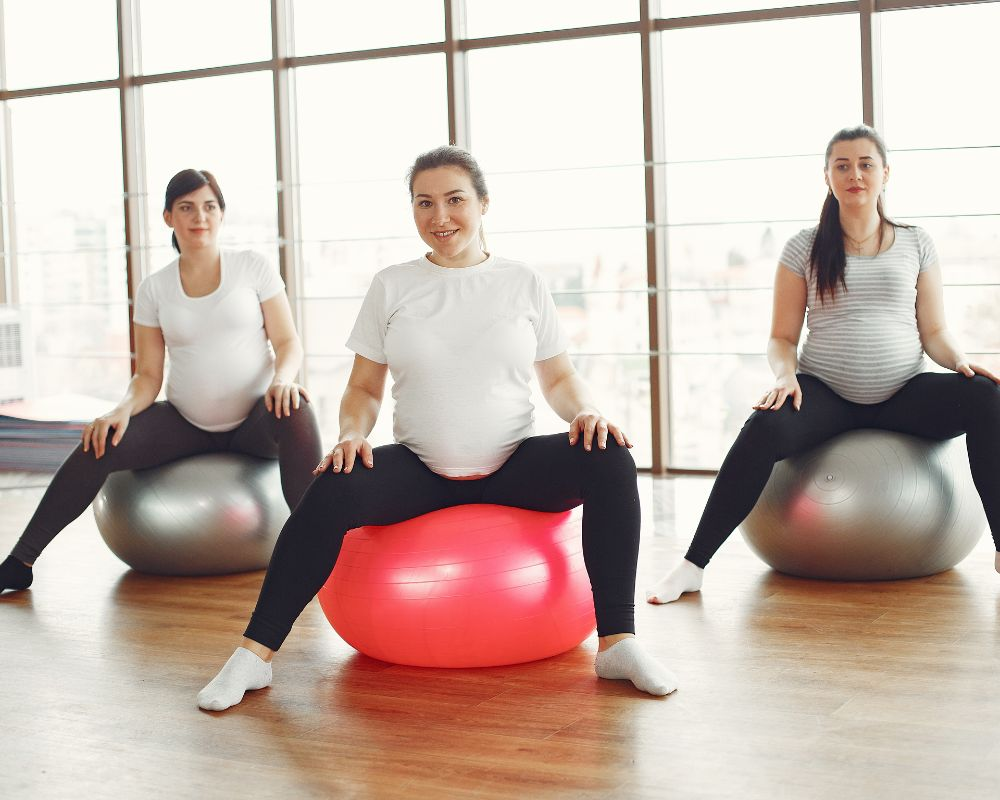

A gestação é um período de transformações profundas, tanto emocionais quanto físicas. Com o passar das semanas, é natural que o corpo sinta o peso das mudanças: dores lombares, inchaço e a alteração do centro de equilíbrio. Se você está em **São Caetano do Sul** e busca uma forma segura de atravessar essa fase com mais disposição e menos desconforto, o **Pilates Clínico para gestantes** é a solução ideal.

No **Instituto do Bem-Estar**, entendemos que este momento exige mais do que um simples exercício; exige um acompanhamento especializado que prioriza a saúde da mãe e do bebê.

## **O que diferencia o Pilates Clínico para Gestantes?**

Muitas futuras mamães têm dúvida se podem praticar Pilates. A resposta é: **sim**, desde que seja o método **clínico**. Diferente do Pilates fitness praticado em academias, o Pilates Clínico é conduzido exclusivamente por **[fisioterapeutas](https://afb.org.br/)**.

Isso significa que cada movimento é adaptado para as limitações biomecânicas de cada trimestre da gravidez, respeitando a frouxidão ligamentar (causada pelo hormônio relaxina) e evitando sobrecargas desnecessárias.

## **Os Principais Benefícios do Pilates na Gestação**

Praticar Pilates Clínico regularmente traz vantagens que refletem diretamente na sua qualidade de vida:

-   **Alívio de Dores Lombares:** O fortalecimento do “core” (centro do corpo) ajuda a sustentar o peso da barriga, reduzindo a pressão na coluna.
-   **Controle da Respiração:** Essencial para o relaxamento diário e um diferencial absoluto na hora do parto.
-   **Redução de Inchaços:** Os exercícios auxiliam na circulação sanguínea e linfática, combatendo a retenção de líquidos.
-   **Fortalecimento do Assoalho Pélvico:** Fundamental para prevenir a incontinência urinária e auxiliar na sustentação dos órgãos pélvicos.

### **Preparação para o Parto e Pós-Parto**

O foco na musculatura pélvica e na mobilidade do quadril facilita o processo de parto normal e contribui para uma recuperação muito mais rápida e eficiente no pós-parto, ajudando o corpo a retomar sua forma e funcionalidade.

## **Quando começar as aulas?**

Geralmente, o Pilates para gestantes é recomendado após a **12ª semana de gestação** (liberação do primeiro trimestre), com autorização do seu obstetra. No entanto, cada caso é único. No Instituto do Bem-Estar, realizamos uma avaliação criteriosa para entender seu histórico de saúde e nível de atividade física prévia.

## **Por que escolher o Instituto do Bem-Estar em São Caetano do Sul?**

Escolher onde realizar seu acompanhamento pré-natal é uma decisão de confiança. Localizado no coração de São Caetano do Sul, o **Instituto do Bem-Estar** une tradição e inovação desde 2007.

1.  **Corpo Técnico Experiente:** Nossos fisioterapeutas são especialistas em anatomia gestacional.
2.  **Atendimento Personalizado:** Não somos uma sala lotada. O foco é em você e nas suas necessidades específicas.
3.  **Abordagem Holística:** Como especialistas em terapias integrativas, olhamos para o seu bem-estar físico, mental e espiritual.
4.  **Histórico de Sucesso:** Mais de 10.000 pacientes já confiaram em nossos processos estruturados e infraestrutura moderna.

## **Perguntas Frequentes (FAQ)**

**1\. O Pilates ajuda no parto normal?** Sim! O trabalho de mobilidade de quadril e o controle muscular ensinado no Pilates Clínico são ferramentas poderosas para facilitar a descida do bebê e o trabalho de parto.

**2\. Tenho diástase, posso fazer Pilates?** Com certeza. O Pilates Clínico é uma das melhores formas de prevenir o agravamento da diástase durante a gravidez e tratá-la precocemente.

**3\. Onde fica o Instituto em São Caetano?** Estamos em uma localização privilegiada e de fácil acesso, com infraestrutura completa para receber gestantes com total conforto.

## **Prepare-se para uma gestação inesquecível**

Você merece viver este momento com leveza e sem dor. Agende uma avaliação no **Instituto do Bem-Estar** e descubra como nosso Pilates Clínico pode transformar sua jornada até a chegada do seu bebê.

[**Clique aqui e fale com nossa equipe pelo WhatsApp**](https://api.whatsapp.com/send/?phone=5511934491001&text=Ol%C3%A1%2C+td+bem%3F+Gostaria+de+saber+mais+sobre+Instituto+do+Bem+Estar+na+https%3A%2F%2Fibemestarscs.com.br%2F&type=phone_number&app_absent=0)
