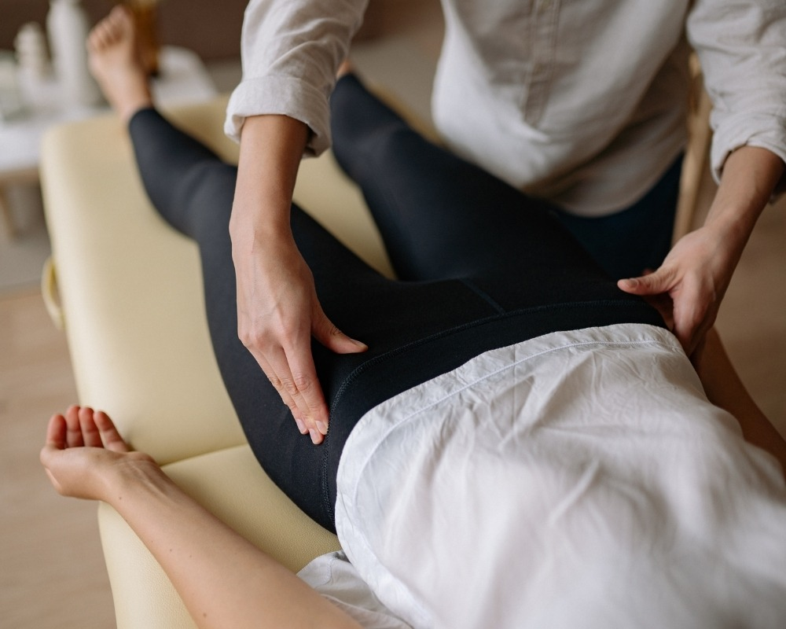

Você sabia que o sucesso de uma cirurgia não termina quando o cirurgião solta o bisturi? Na verdade, o procedimento é apenas 50% do caminho. A outra metade, crucial para que você recupere sua mobilidade e qualidade de vida sem sequelas, acontece na **recuperação pós-operatória**.

Muitos pacientes acreditam que o repouso absoluto é a única regra, mas a ciência moderna mostra que a reabilitação ativa e especializada é o que realmente diferencia uma cura “lenta e dolorosa” de uma **recuperação acelerada e segura**.

Neste artigo, vamos explorar como o acompanhamento profissional transforma o seu processo de cura e quais técnicas são indispensáveis para você voltar à sua rotina com confiança.

**Leia também:** [Fisioterapia em São Caetano do Sul: Recupere sua Qualidade de Vida no Instituto do Bem Estar](/blog/fisioterapia-em-sao-caetano-do-sul)

## **Por que a Fisioterapia Especializada é indispensável?**

Após um procedimento cirúrgico — seja ortopédico, cardíaco ou estético — o corpo entra em um estado de alerta. Inflamações, edemas (inchaços) e dor são reações naturais, mas que precisam ser gerenciadas.

O acompanhamento especializado atua em três frentes principais:

1.  **Prevenção de Complicações:** Evita riscos graves como trombose venosa profunda (TVP), aderências cicatriciais e fibroses.
2.  **Gerenciamento da Dor:** Através de técnicas manuais e recursos como a **Ozonioterapia**, é possível reduzir a inflamação e a dependência de medicamentos analgésicos.
3.  **Restauração da Função:** Não basta a cicatriz fechar; é preciso que o músculo recupere a força e a articulação recupere o movimento.

## **Técnicas que aceleram a sua volta à rotina**

No **Instituto Bem Estar**, unimos a tecnologia à Medicina Tradicional para criar um protocolo de reabilitação único. Veja as principais abordagens:

### **Hidroterapia: O poder da água na reabilitação**

Para quem não pode carregar peso ou sente muita dor ao se movimentar, a hidroterapia é o “pulo do gato”. A [flutuabilidade](https://blog.barradopara.com.br/glossario/o-que-e-flutuabilidade/) reduz a carga nas articulações, permitindo que o paciente realize movimentos que seriam impossíveis no solo, acelerando o ganho de mobilidade.

### **Ozonioterapia e Acupuntura**

Enquanto a Ozonioterapia foca na oxigenação dos tecidos e combate a processos inflamatórios, a Acupuntura trabalha no equilíbrio do sistema nervoso, sendo uma aliada poderosa no controle da dor crônica pós-cirúrgica.

### **Pilates Clínico e Terapias Manuais**

Diferente do pilates convencional, o **Pilates Clínico** é conduzido por fisioterapeutas. Ele é essencial na fase final da reabilitação para devolver o equilíbrio, a postura e a força necessária para as atividades do dia a dia.

## **O Diferencial do Instituto Bem Estar**

Escolher onde realizar sua recuperação é uma decisão que impacta o resto da sua vida. Desde 2007, o **Instituto Bem Estar** já ajudou mais de **10.000 pacientes** a retomarem suas vidas.

Nossa missão vai além do tratamento físico. Praticamos terapias integrativas que visam restabelecer a saúde física, mental e espiritual. Com uma infraestrutura moderna e um corpo técnico experiente, garantimos que cada projeto de reabilitação seja tão único quanto o paciente.

### **Perguntas Rápidas sobre Pós-Operatório:**

-   **Quanto tempo após a cirurgia devo começar a fisioterapia?** Na maioria dos casos, o quanto antes (muitas vezes nas primeiras 24h ou 48h), sempre respeitando a liberação médica.
-   **Posso fazer reabilitação se ainda sinto dor?** Sim! Existem técnicas específicas para tratar a dor antes mesmo de começar os exercícios de força.
-   **A hidroterapia é segura para cicatrizes?** Sim, desde que a cicatriz esteja devidamente fechada e protegida conforme orientação do especialista.

**Sua saúde merece um cuidado integral.** Não deixe sua recuperação ao acaso. O acompanhamento especializado é o investimento que garante que os resultados da sua cirurgia sejam duradouros e eficazes.

**Precisa de um plano de reabilitação personalizado?** [Clique aqui e fale com nossos especialistas no Instituto Bem Estar](/contato).
