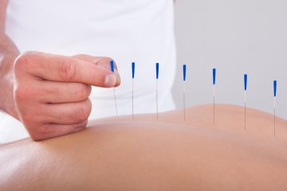
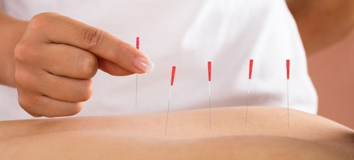
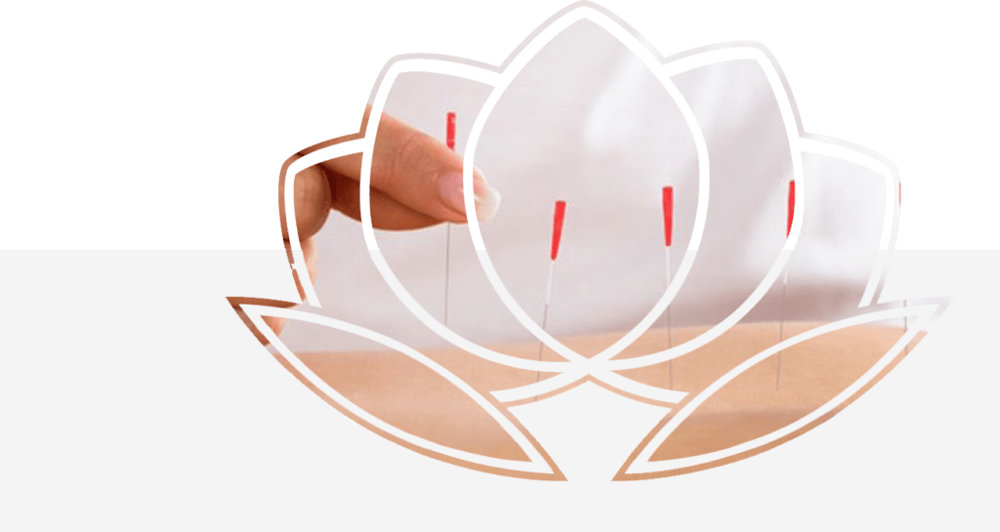

## Acupuntura

## Experimente a Acupuntura

Acupuntura é um recurso extraído da sistemática de cura da Medicina Tradicional Chinesa (MTC), logo se trata de uma técnica, que se utiliza de um processo de agulhamento em pontos específicos do corpo humano com intuito de promover alívio de dores, relaxamento físico e mental, ativar processos antinflamatórios e otimizar o funcionamento do sistema imunológico.

[Agende uma consulta](https://wa.me/5511934491001)

## Acupuntura - Técnica Milenar Chinesa

    O **Instituto do Bem Estar** vem desenvolvendo a tradicional medicina chinesa de forma clássica, onde utilizamos não apenas a técnica da acupuntura como recurso terapêutico, mas as diversas outras técnicas que congregam essa medicina milenar.

    **Técnicas utilizadas em terapia:**
• Acupuntura
• Reflexologia
• Auriculopuntura / Auriculoterapia
• Moxabustão
• Fitoterapia
• Craniopuntura / Acupuntura Escalpeana
• Qi Gong
• Massagens Orientais (Shiatsu, Doin, Tuina, etc.)
• Ventosa
• Sangria (pontos de Acupuntura)

    Logo em nosso tratamento utilizamos dessas diversas técnicas para compor uma sessão de acupuntura, com intenção de sermos mais precisos em nossos resultados.

    **Indicações:**
    O tratamento de acupuntura tem várias indicações clínicas que variam desde patologias físicas até patológicas mentais (psíquicas), iremos dividir as indicações em dois grandes grupos, indicações físicas e indicações mentais ou psíquicas.

    **Indicações Físicas:**
– Dores agudas ou crônicas de diversas naturezas tais como:
– Coluna, Joelhos, Ombros, Quadris, Tornozelos (dores articulares)
– Ciatalgia
– Cefaleias, Enxaquecas
– Artroses, Artrites reumatoide, Gota (doenças reumáticas)
– Gastrite, Esofagite, Amidalite (inflamações de ordem gástricas)
– Rinite, Sinusite, Bronquite (inflamações do sistema respiratório)
– Tendinites, Bursite (inflamações do sistema locomotor)

    • **Patologias Neurológicas:
**
– Acidente Vascular Encefálico (AVE / Derrame), Hemiplegias
– Síndromes Neurológicas (diversas)
– Traumatismo Craniano
– Lesão Medular
– Esclerose Múltipla
– Paralisias Facial

    • **Distúrbios de Alimentação e Controle do Peso:
**
– Obesidade
– Anorexia
– Constipação

     **• Síndromes Respiratórias:**

– Resfriado / Gripe
– Asma
– Tosse e Bronquite
– Rinite e Sinusite
– Afecções de Garganta e perda de voz, entre outras deveras síndromes que acometem o físico ou corpo.

    **Indicações Mentais ou Psíquicas:**
• Depressão
• Síndrome de Ansiedade
• Síndrome do Pânico
• Hiperatividade e Déficit de Atenção
• Síndrome de Euforia
• Labilidade Emocional
• Controle do Medo, Angústia, Raiva, Ira, Cólera, Preocupação, Tristeza, Choque, Estado Pensativo ou Reflexivo.

    **A Sessão:**
    Duração de avaliação de 1 hora e 30 minutos aproximadamente, onde neste momento será realizado um diagnóstico físico e energético, com orientações a aplicação das técnicas elegidas, segundo a medicina tradicional chinesa para o tratamento.

    As demais sessões tem durações de 1 hora aproximadamente, com associação de cromoterapia no ambiente, musicoterapia e aromaterapia para garantir um ambiente tranquilo e relaxante.

## A Sessão

-   Duração em torno de 1hora
-   Diagnóstico físico e energético
-   Orientações a aplicação das técnicas elegidas
-   Medicina tradicional chinesa para o tratamento
