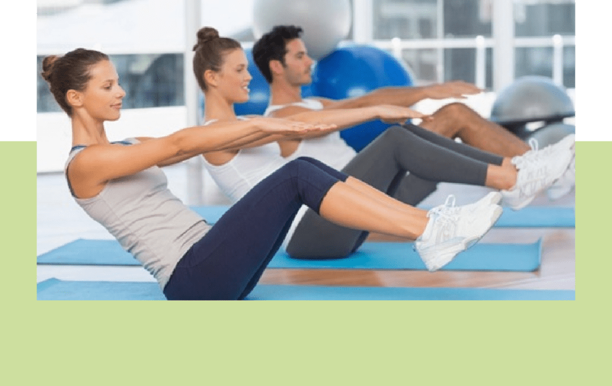

## Pilates Clinico

## Por que escolher o Pilates?

## Assista o vídeo e saiba mais.

Desde o pós operado até o atleta de alta performance, o pilates é uma excelente prática para poder proporcionar bem estar e qualidade de vida. Venha conhecer!

[Agende uma consulta](https://wa.me/5511999178199)

## Pilates desenvolvido por Fisioterapeutas

No Instituto do Bem Estar o Pilates é desenvolvido por Fisioterapeutas que, através de sua formação em fisioterapia associada a técnica do Pilates, são capazes de desenvolver essa técnica que trabalha a mente e o corpo em conjunto, baseado nos princípios de concentração, controle, centralização, precisão e respiração. Aspectos estes responsáveis pela harmonização do organismo durante a prática.

​

## Reabilitação ou Fitness

Toda conduta e exercícios abordados no Pilates estão baseados no objetivo proposto para cada pessoa, visando a evolução, que pode ter caráter de reabilitação ou fitness.
Para tanto, pensando na ampla abordagem, o pilates pode ou não estar associado a exercícios funcionais. Isso é possível porque o espaço do Studio de Pilates também conta com o Studio Fitness. O terapeuta tem a possibilidade de atender a todas as necessidades que o aluno apresenta.

## A Sessão

-   Duração em torno de 50 minutos
-   Atendimento Personalizado e Individual
-   Piscina Aquecida e Ambiente Climatizado
-   Avaliação Fisioterapêutica em solo e água
