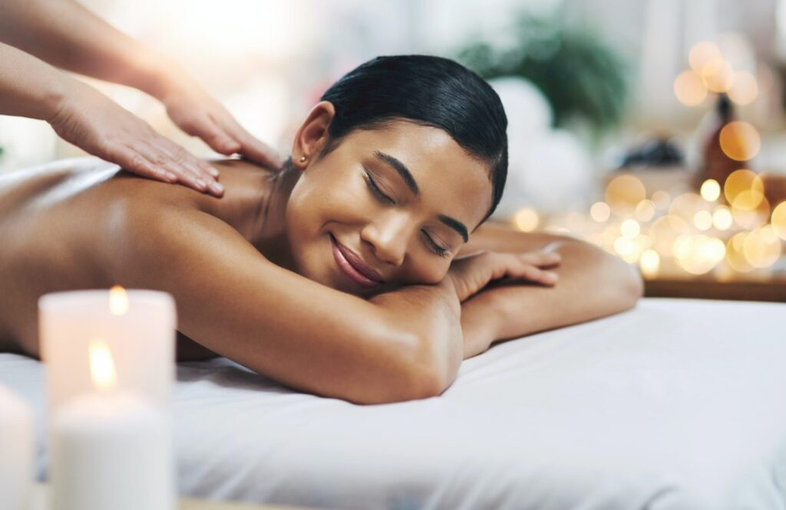
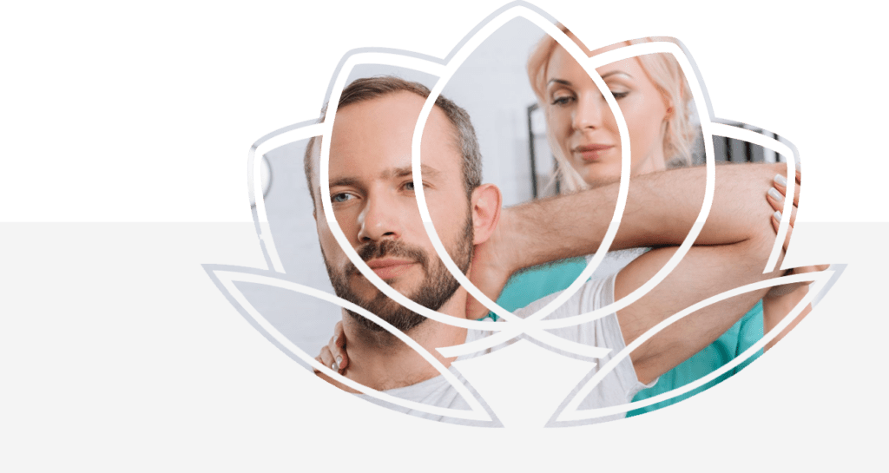

## Terapias Manuais

## Terapias Manuais: Alívio e Bem-Estar

Terapias manuais são técnicas terapêuticas que utilizam toques e manipulações físicas para aliviar dores, melhorar a mobilidade e promover o bem-estar. Incluem abordagens como massagem, quiropraxia, osteopatia e microfisioterapia.

[Agende uma consulta](https://wa.me/5511934491001)

## Terapias Manuais - Massagem Relaxante​

## Conceito​

Tem um conceito de Revitalizar o corpo através do relaxamento global.​​​

## Efeitos Fisiológicos​

Relaxamento muscular com alívio das tensões, alívio das dores, melhora da vascularização tecidual, orientação das fibras musculares, melhor vascularização das cápsulas articulares e desbloqueios articulares.​​​

## Abordagem​

Utilizamos o conceito das terapias manuais orientais como linha orientadora que nos guia nessa terapia através de um blend de técnicas para alcançar os objetivos propostos.​​​

## Duração​

A sessão de Massagem Relaxante tem duração de 60 minutos.​​​​

## Terapias Manuais - Drenagem Linfática​

## Definição​

Drenagem linfática é uma técnica de terapia manual que tem como objetivo estimular o sistema linfático a circular e com isso eliminar o excesso de fluidos corporais e suas toxinas.​​​​

## Benefícios​

Apoiada em evidências científicas, é reconhecida e indicada para auxiliar em vários tratamentos, além de promover relaxamento e bem-estar.​​​​

## Aplicação Clínica​

Tem por objetivo a redução de edemas e linfedemas e a prevenção ou melhoria de algumas de suas consequências, tais como patologias vasculares e traumáticas.​​​​​

## Sistema Imunológico​

Também se apresenta como um ótimo recurso para melhoria do sistema Imunológico.​​​​​​

## A Sessão

-   Duração em torno de 1hora
-   Massagem terapêutica.
-   Quiropraxia.
-   Reflexologia.
